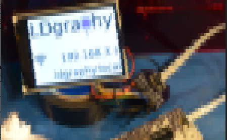
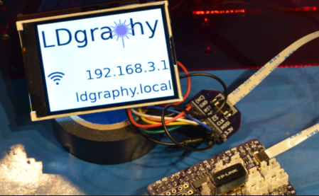
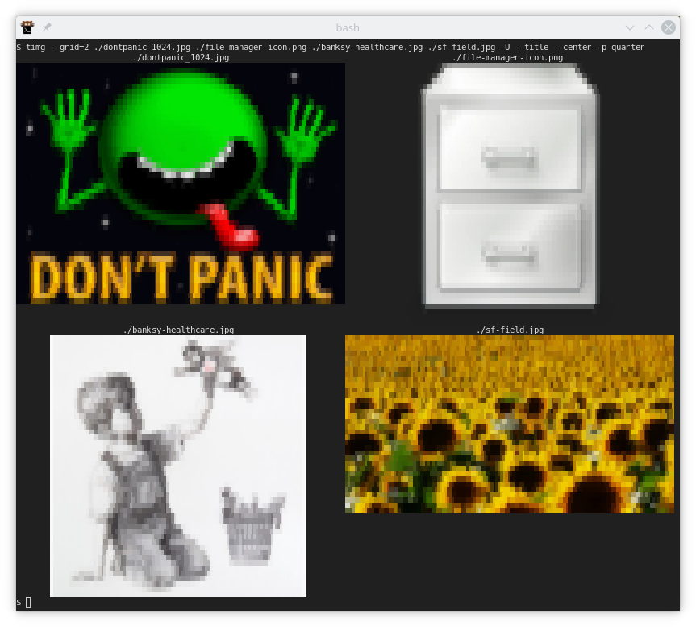
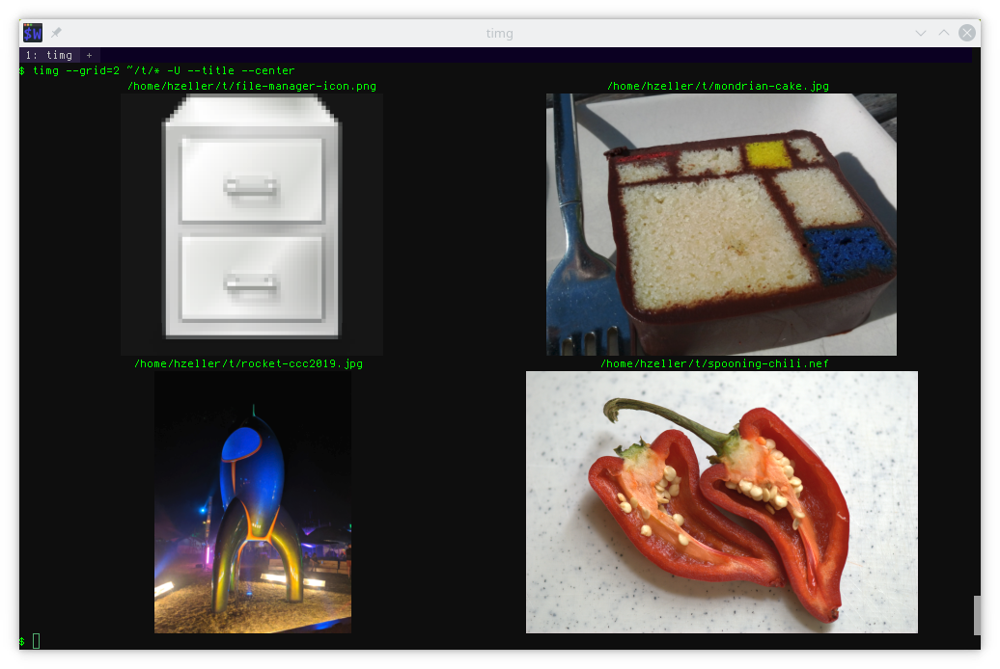
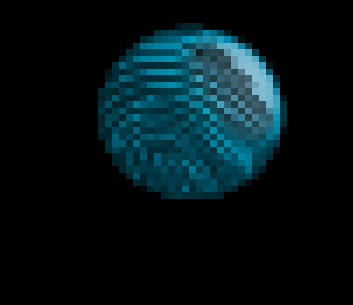

timg - Terminal Image and Video Viewer
======================================

[](https://github.com/hzeller/timg/blob/main/LICENSE) &nbsp;
[](../../actions?query=workflow%3A"Ubuntu+Build")
[](../../actions?query=workflow%3A"macOS+Build")
[](../../actions?query=workflow%3A"macOS+Brew+Building+HEAD")


### https://timg.sh/

A user-friendly viewer that uses 24-Bit color capabilities and unicode
character blocks to display images, animations and videos in the terminal.

On terminals that implement the [Kitty Graphics Protocol] or the
[iTerm2 Graphics Protocol] this displays images in full resolution.


Displays regular images, plays animated gifs, scrolls static images and
plays videos.

Useful if you want to have a quick visual check without leaving the comfort
of your shell and having to start a bulky image viewer. Sometimes this is the
only way if your terminal is connected remotely via ssh. And of course if you
don't need the resolution. While icons typically fit pixel-perfect, larger
images are scaled down to match the resolution.

The command line accepts any number of image/video filenames that it shows
in sequence one per page or in a grid in multiple columns, depending on your
choice of `--grid`. The output is emitted in-line with minimally messing
with your terminal, so you can simply go back in history using your terminals'
scroll-bar (Or redirecting the output to a file allows you to later
simply `cat` that file to your terminal. Even `less -R` seems to be happy with
it).

#### Pixelation
On a regular terminal, block-characters are used to output images. Half blocks
present pixels color-accurately, and quarter blocks provide a higher spatial
resolution at the expense of slightly worse color accuracy. These modes should
be compatible with most common terminals that support UTF8 and 24Bit color.

If you are on a [Kitty][Kitty Graphics Protocol], [iTerm2], or [wezterm]
terminal, images can be shown in full resolution.

-p half  | -p quarter            | -p kitty  or -p iterm2            |
---------|-----------------------|-----------------------------------|
 |  |  |

#### Grid display

Images can be shown in a grid, which is very useful if you quickly want to
sieve through a lot of images. You can choose to show the filename as title,
so it is easy to find exactly the filename you're looking for (The following
grid uses `--grid=2` and is pixelated with `-pq`).


<details>
<summary>This is how the same grid looks with Kitty or iTerm2 Graphics mode...</summary>



</details>

### Synopsis

```
usage: timg [options] <image/video> [<image/video>...]
Options:
        -g<w>x<h>      : Output geometry in character cells. Partial geometry
                         leaving out one value -g<w>x or -gx<h> is possible,
                         the other value it then derived from the terminal size.
                         Default derived from terminal size is 160x50
        -p<pixelation> : Pixelation: 'h' = half blocks    'q' = quarter blocks
                                     'k' = kitty graphics 'i' = iTerm2 graphics
                         Default: Auto-detect graphics, otherwise 'quarter'.
        --compress     : Only for -pk or -pi: Compress image data. More
                         CPU use for timg, but less bandwidth needed.
        -C, --center   : Center image horizontally.
        -W, --fit-width: Scale to fit width of available space, even if it
                         exceeds height.
        --grid=<cols>[x<rows>] : Arrange images in a grid (contact sheet).
        -w<seconds>    : Wait time between images (default: 0.0).
        -a             : Switch off anti aliasing (default: on).
        -b<str>        : Background color to use behind alpha channel. Format
                         'yellow', '#rrggbb', 'auto' or 'none' (default 'auto').
        -B<str>        : Checkerboard pattern color to use on alpha.
        --pattern-size=<n> : Integer factor scale of the checkerboard pattern.
        --auto-crop[=<pre-crop>] : Crop away all same-color pixels around image.
                         The optional pre-crop is the width of border to
                         remove beforehand to get rid of an uneven border.
        --rotate=<exif|off> : Rotate according to included exif orientation.
                              or 'off'. Default: exif.
        --clear        : Clear screen first. Optional argument 'every' will
                         clear before every image (useful with -w)
        -U, --upscale[=i]: Allow Upscaling. If an image is smaller than the
                         available frame (e.g. an icon), enlarge it to fit.
                         Optional parameter 'i' only enlarges in integer steps.
        -V             : Directly use Video subsystem. Don't probe image
                         decoding first (useful, if you stream video from stdin)
        -I             : Only  use Image subsystem. Don't attempt video decoding
        --title[=<fmt_str>]: Print title above each image. Accepts the following
                         format parameters: %f = full filename; %b = basename
                                            %w = image width; %h = height
                                            %D = internal decoder used
                         If no parameter is given, defaults to "%f"
        -F             : Print filename as title. Behaves like --title="%f"
        -f<filelist>   : Read newline-separated list of image files to show.
                         (Can be provided multiple times.)
        -o<outfile>    : Write to <outfile> instead of stdout.
        -E             : Don't hide the cursor while showing images.
        --threads=<n>  : Run image decoding in parallel with n threads
                         (Default 2, half #cores on this machine)
        --color8       : Choose 8 bit color mode for -ph or -pq
        --version      : Print version and exit.
        -h, --help     : Print this help and exit.

  Scrolling
        --scroll=[<ms>]       : Scroll horizontally (optionally: delay ms (60)).
        --delta-move=<dx:dy>  : delta x and delta y when scrolling (default:1:0)

  For Animations, Scrolling, or Video
  These options influence how long/often and what is shown.
        --loops=<num> : Number of runs through a full cycle. -1 means 'forever'.
                        If not set, videos loop once, animated images forever
                        unless there is more than one file to show.
        --frames=<num>: Only show first num frames (if looping, loop only these)
        -t<seconds>   : Stop after this time, independent of --loops or --frames
```

### Examples
```bash
timg some-image.jpg                # display a static image
timg -g50x50 some-image.jpg        # display image fitting in box of 50x50 pixel

# Multiple images
timg *.jpg                         # display all *.jpg images
timg --title *.jpg                 # .. show name in title (short option -F)
timg --title="%b (%wx%h)" *.jpg    # show short filename and image size as title
timg --grid=3x2 *.jpg              # arrange in 3 columns, 2 rows in terminal
timg --fit-width --grid=3 *.jpg    # maximize use of column width (short: -W)
timg --grid=3 -t5 *.gif            # Load gifs one by one in grid. Play each for 5sec.

# Putting it all together; making an alias to list images; let's call it ils = 'image ls'
# This prints images two per row with a filename title. Only showing one frame
# so for animated gifs only the first frame is shown statically.
# With hi-res iTerm or Kitty terminals, consider more columns, e.g --grid=4x1
# Put this line in your ~/.bashrc
alias ils='timg --grid=2x1 --upscale=i --center --title --frames=1 '

# ... using this alias on images outputs a useful column view
ils *.jpg *.gif

# Read the list of images to load from a file. One filename per line.
locate "*.jpg" > /tmp/allimg.txt ; timg -f /tmp/allimg.txt

# Show a PDF document, use full width of terminal, trim away empty border
timg -W --auto-crop some-document.pdf
timg --frames=1 some-document.pdf    # Show a PDF, but only first page

# Reading images from a pipe. The filename '-' means 'read from stdin.
# In this example generating a QR code and have timg display it:
qrencode -s1 -m2 "http://timg.sh/" -o- | timg -

# Open an image from a URL. URLs are internally actually handled by the
# video subsystem, so it is treated as a single-frame 'film', nevertheless,
# many image-URLs just work. But some image-specific features, such as trimming
# or scrolling, won't work.
timg --center https://i.kym-cdn.com/photos/images/newsfeed/000/406/282/2b8.jpg

# Sometimes, it is necessary to manually crop a few pixels from an
# uneven border before the auto-crop finds uniform color all-around to remove.
# For example with --auto-crop=7 we'd remove first seven pixels around an image,
# then do the regular auto-cropping.
#
# The following example loads an image from a URL; --auto-crop does not work with
# that, so we have to get the content manually, e.g. with wget. Piping to
# stdin works; in the following example the stdin input is designated with the
# special filename '-'.
#
# For the following image, we need to remove 3 pixels all around before
# auto-crop can take over removing the remaining whitespace successfully:
wget -qO- https://imgs.xkcd.com/comics/a_better_idea.png | timg --auto-crop=3 -

timg multi-resolution.ico   # See all the bitmaps in multi-resolution icons-file
timg --frames=1 multi-resolution.ico  # See only the first bitmap in that file

timg some-video.mp4         # Watch a video.

# Play content of webcam (This assumes video4linux2, but whatever input devices
# are supported on your system with libavdevice-dev)
timg /dev/video0

# If you read a video from a pipe, it is necessary to skip attempting the
# image decode first as this will consume bytes from the pipe. Use -V option.
youtube-dl -q -o- -f'[height<480]' 'https://youtu.be/dQw4w9WgXcQ' | timg -V -

# Show animated gif, possibly limited by timeout, loops or frame-count
timg some-animated.gif      # show an animated gif forever (stop with Ctrl-C)
timg -t5 some-animated.gif                   # show animated gif for 5 seconds
timg --loops=3 some-animated.gif             # Loop animated gif 3 times
timg --frames=3 --loops=1 some-animated.gif  # Show only first three frames
timg --frames=1 some-animated.gif            # Show only first frame. Static image.

# Scroll
timg --scroll some-image.jpg       # scroll a static image as banner (stop with Ctrl-C)
timg --scroll=100 some-image.jpg   # scroll with 100ms delay

# Create a text with the ImageMagick 'convert' tool and send to timg to scroll
convert -size 1000x60 xc:none -fill red -gravity center -pointsize 42 \
        -draw 'text 0,0 "Watchen the blinkenlights..."' -trim png:-   \
      | timg --scroll=20 -

# Scroll direction. Horizontally, vertically; how about diagonally ?
timg --scroll --delta-move=1:0 some-image.jpg  # scroll with dx=1 and dy=0, so horizontally.
timg --scroll --delta-move=-1:0 some-image.jpg # scroll horizontally in reverse direction.
timg --scroll --delta-move=0:2 some-image.jpg  # vertical, two pixels per step.
timg --scroll --delta-move=1:1 some-image.jpg  # diagonal, dx=1, dy=1

# Background color for transparent images (SVG-compatible strings are supported)
# and generally useful if you have a transparent PNG that is otherwise hard
# to see on your terminal background.
timg -b auto some-transparent-image.png  # use terminal background if possible
timg -b none some-transparent-image.png  # Don't use blending
timg -b lightgreen some-transparent-image.png
timg -b 'rgb(0, 255, 0)' some-transparent-image.png
timg -b '#0000ff' some-transparent-image.png

# Checkerboard/Photoshop-like background on transparent images
timg -b lightgray -B darkgray some-transparent-image.png

# .. with adjustable size.
timg -b lightgray -B darkgray --pattern-size=4 some-transparent-image.png
```

##### Partially transparent icon on champagne-colored terminal emulator

-b auto  | -b lightgreen | -b lightgreen -B yellow | -b none  |
---------|---------------|-------------------------|----------|
 |   |  | 

--pattern-size=1                       | --pattern-size=4 |
---------------------------------------|--------------------------------------|
 |  |

#### Include in file browsers

There are many terminal based file-browsers. Adding `timg` to their
configuration is usually straight forward.
```
# Another use: can run use this in a fzf preview window:
echo some-image.jpg | fzf --preview='timg -E --frames=1 --loops=1 -g $(( $COLUMNS / 2 - 4 ))x$(( $FZF_PREVIEW_LINES * 2 )) {}'

# Use in vifm. ~/.config/vifm/vifmrc
filextype *.avi,*.mp4,*.wmv,*.dat,*.3gp,*.ogv,*.mkv,*.mpg,*.mpeg,*.vob,
         \*.fl[icv],*.m2v,*.mov,*.webm,*.ts,*.mts,*.m4v,*.r[am],*.qt,*.divx,
         \*.as[fx]
        \ {View in timg}
        \ timg --title --center --clear %f,

filextype *.bmp,*.jpg,*.jpeg,*.png,*.gif,*.xpm
        \ {View in timg}
        \ timg --title --center --clear %f; read -n1 -s -r -p "Press any key to return",
```

#### Other fun things

```bash
# Also, you could store the output and cat later to your terminal...
timg -g80x40 some-image.jpg > /tmp/imageout.txt
cat /tmp/imageout.txt

# Of course, you can redirect the output to somewhere else. I am not suggesting
# that you rickroll some terminal by redirecting timg's output to a /dev/pts/*
# you have access to, but you certainly could...

# Of course, you can go really crazy by storing a cycle of an animation. Use xz
# for compression as it seems to deal with this kind of stuff really well:
timg -g60x30 --loops=10 nyan.gif | xz > /tmp/nyan.term.xz

# ..now, replay the generated ANSI codes on the terminal. Since it would
# rush through as fast as possible, we have to use a trick to wait between
# frames: Each frame has a 'move cursor up' escape sequence that contains
# an upper-case 'A'. We can latch on that to generate a delay between frames:
xzcat /tmp/nyan.term.xz | gawk '/\[.*A/ { system("sleep 0.1"); } { print $0 }'

# You can wrap all that in a loop to get an infinite repeat.
while : ; do xzcat... ; done

# (If you Ctrl-C that loop, you might need to use 'reset' for terminal sanity)
```

### Terminal considerations

This section contains some details that you only might need to ever look at if
the output is not as expected.

#### Half block and quarter block rendering

The half block pixelation (`-p half`) uses the the unicode
character [▄](U+2584 - 'Lower Half Block')
_or_ [▀](U+2580 - 'Upper Half Block') (depending on the
[`TIMG_USE_UPPER_BLOCK`](#half-block-choice-of-rendering-block)
environment variable). If the top and bottom color is the same, a simple
space with background color is used.

The quarter block pixelation (`-p quarter`) uses eight different blocks.

With both of these pixelations, choosing the foreground color and background
24-bit color, `timg` can simulate 'pixels'. With the half-block pixelation,
this can assign the correct color to the two 'pixels' available in one
character cell, in the quarter pixelation, four 'pixels' have to share two
colors, so the color accuracy is slighlty worse but it allows for higher spatial
resolution.

The `-p` command line flag allows to choose between `-p half`, `-p quarter`,
also possible to just shorten to `-ph` and `-pq`. Default is `-pq`
(see [above](#pixelation) how this looks like).

Terminals that don't support Unicode or 24 bit color will probably not show
a very pleasent output. For terminals that only do 8 bit color, use the
`--color8` command line option.

#### Some terminals support direct image output

The [Kitty], [iTerm2], and [wezterm] terminals have a special feature that
allows for directly displaying high-resolution pictures.
If `timg` is running in such a terminal, it will automatically use that mode.
(You can choose Kitty mode explicitly with `-pk`, iTerm and wezterm mode
with `-pi`).

All the features with arranging images (center, grid, adding titles) or
transparency settings behave exactly the same.

Note, if watching videos remotely with this is too slow (due to high bandwidth
requirements or simply because your terminal has to do more work), try
setting the environment variable `TIMG_ALLOW_FRAME_SKIP=1` to allow timg
leaving out frames to stay on track (see `man timg`, environment variable
section).

#### Half block: Choice of rendering block

By default, `timg` uses the 'lower half block' to show the pixels in `-p half`
mode. Depending on the font the terminal is using, using the upper block might
look better, so it is possible to change the default with an environment
variable.
Play around with this value if the output looks poor on your terminal. I found
that on my system there is no difference for [`konsole`][konsole] or `xterm` but the
[`cool-retro-term`][cool-retro-term] looks better with the lower block, this is why it is the default.

In some terminals, such as [alacritty] (and only with certain font sizes),
there seems to be the opposite working better. To change, set this environment
variable:

```
export TIMG_USE_UPPER_BLOCK=1   # change default to use upper block.
```
(this only will work fully with `-p half`. In `-p quarter` mode, there are
additional blocks that can't be worked around)

##### What a problematic choice of block looks like

The image generally looks a bit 'glitchy' if the terminal leaves little
space between blocks, so that the wrong background color shows on a single
line between pixels.
This is likely not intended by the terminal emulator and possibly happening
on rounding issues of font height or similar.

Anyway, we can work around it (fully in `-p half`, partially in `-p quarter`
mode). In the following illustration you see how that looks like. If you
see that, change the `TIMG_USE_UPPER_BLOCK` environment variable.


Glitchy. Change TIMG_USE_UPPER_BLOCK| Looks good
------------------------------------|-------------------------------|
     | |

#### Other artifacts

Some terminals leave one pixel of horizontal space between characters that
result in fine vertical lines in the image.
That can't be worked around, send a bug or better pull request to your terminal
emulator.

#### Wrong font aspect ratio

Usually, timg attempts to determine the font aspect ratio and apply some
correction if it is off from the nominal 1:2. But if you notice that the
image displayed is not quite the right aspect ratio because of the terminals
font used, you can set an environment variable `TIMG_FONT_WIDTH_CORRECT` with
a factor to make it look correctly.

Increasing the visual width by 10% would be setting the value to 1.1 for
instance.

```
export TIMG_FONT_WIDTH_CORRECT=1.1
timg myimage.jpg
```

This is an environment variable, so that you can set it once to best fit your
terminal emulator of choice and don't have to worry about later.

##### Example
Terminal font too narrow   | Correct. Here with `TIMG_FONT_WIDTH_CORRECT=1.375`
---------------------------|-------------------------------|
  | |


#### Tested terminal emulators

(Needs update; these comparisons are from 2016 when I tested this last with
timg, so newer terminals are probably even better).

Tested terminals: `konsole` >= 2.14.1, `gnome-terminal` > 3.6.2 look good,
recent xterms also seem to work (albeit with less color richness).
Like gnome-terminal, libvte based terminals in general should work, such as
Xfte or termite.
Also QTerminal is confirmed working.

Linux console seems to be limited in colors and does not show the block
character - if you know how to enable the unicode character or full color
there, please let me know.

For Mac users, at least the combination of macOS 11.2 and iTerm2 3.4.3 works.

### Install pre-built package

<a href="https://repology.org/project/timg/versions">

</a>

#### Debian-based systems

```bash
sudo apt install timg
```

#### NixOS or Nix package manager

```bash
nix-env -iA nixpkgs.timg
```

#### macOS

```bash
brew install timg
```

#### Linux distributions that support snap packages

If you have enabled support for snap packages in your Linux distribution, you can install `timg` with
```
sudo snap install timg
```

### Build from source

#### Get dependencies on Debian/Ubuntu

```bash
sudo apt install cmake git g++ pkg-config
sudo apt install libgraphicsmagick++-dev libturbojpeg-dev libexif-dev libswscale-dev # needed libs

# If you want to include video decoding, also install these additional libraries
sudo apt install libavcodec-dev libavformat-dev

sudo apt install libavdevice-dev # If you want to read from video devices such as v4l2

sudo apt install libopenslide-dev # If you want to add OpenSlide images support

sudo apt install pandoc  # If you want to recreate the man page
```

#### Get dependencies on NixOS or Nix package manager

The dependencies are set-up in the shell.nix, so you're ready to go opening
a nix shell

```bash
nix-shell
```

#### Get dependencies on macOS

```bash
# Homebrew needs to be available to install required dependencies
brew install cmake git GraphicsMagick webp jpeg-turbo libexif  # needed libs

# If you want to include video decoding, install these additional libraries
brew install ffmpeg

# If you want to add OpenSlide images support
brew install openslide

brew install pandoc  # If you want to recreate the man page
```

#### Get repo and compile timg

In the script below you see that the build system allows for some
compile-time choices:

  * **`WITH_VIDEO_DECODING`** allow for video decoding. Requires ffmpeg-related
     libraries. You typically want this **ON** (default)
     * **`WITH_VIDEO_DEVICE`** this allows for accessing connected video
     devices, e.g. you can watch your webcam input (requires
     `WITH_VIDEO_DECODING`).
  * **`WITH_GRAPHICSMAGICK`** This is the main image loading library so you
    typically want this **ON** (default).
  * **`WITH_TURBOJPEG`** If enabled, uses this for faster jpeg file loading.
     You typically want this **ON** (default).
  * **`WITH_OPENSLIDE_SUPPORT`** Openslide is an image format used in scientific
    applications. Rarely used, so default off, switch ON if needed.
  * **`WITH_QOI_IMAGE`** Allow decoding of Quite Ok Image format [QOI]. Small
     and simple, default **ON**.
  * **`WITH_STB_IMAGE`** Compile the simpler STB image library directly into
    the timg binary in cases where Graphicsmagick is not suitable for
    dependency pruning reasons; output can be slower and of less quality.
    It is default **ON** (default) but will always only attempted
    after other image loading fails. Turn off if you can use GraphicsMagick and
    want to reduce potential security vectors.

You can choose these options by providing `-D<option>=ON` on the cmake command
line, see below.

```bash
git clone https://github.com/hzeller/timg.git  # Get repo
cd timg  # Enter the checked out repository directory.
mkdir build  # Generate a dedicated build directory.
cd build
# WITH_VIDEO_DECODING enables video; WITH_VIDEO_DEVICE reading from webcam
# WITH_OPENSLIDE_SUPPORT enables support to OpenSlide images
cmake ../ -DWITH_VIDEO_DECODING=On -DWITH_VIDEO_DEVICE=On -DWITH_OPENSLIDE_SUPPORT=On
make
```

#### Install

You can run timg directly in the build directory using `src/timg`. To install
the binary and [manpage](man/timg.1.md) on your system, type in the build directory:

```bash
sudo make install
```

[24-bit-term]: https://gist.github.com/XVilka/8346728
[cool-retro-term]: https://github.com/Swordfish90/cool-retro-term
[konsole]: https://konsole.kde.org/
[alacritty]: https://github.com/alacritty/alacritty
[Kitty]: https://sw.kovidgoyal.net/kitty/
[Kitty Graphics Protocol]: https://sw.kovidgoyal.net/kitty/graphics-protocol.html
[iTerm2]: https://iterm2.com/
[iTerm2 Graphics Protocol]: https://iterm2.com/documentation-images.html
[wezterm]: https://wezfurlong.org/wezterm/
[QOI]: https://qoiformat.org/
